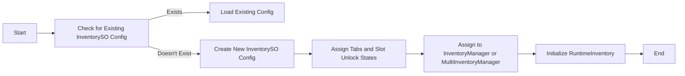
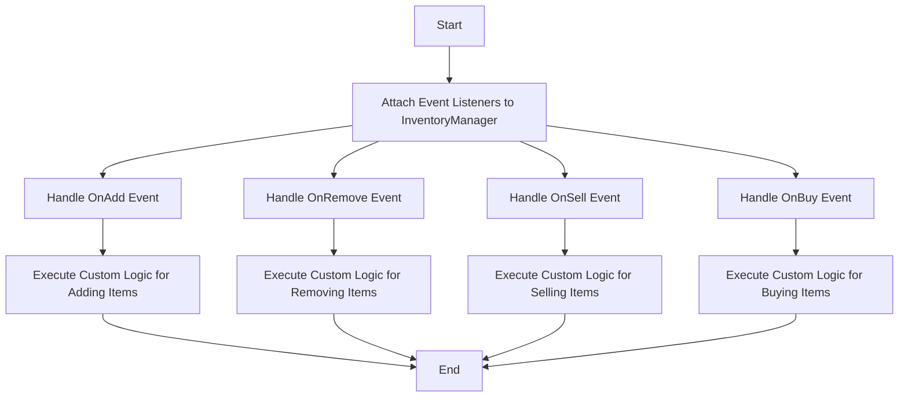
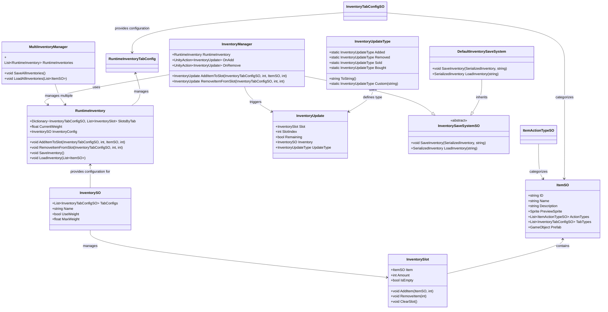

# Inventory System

A modular and flexible Unity Inventory System that supports dynamic item management, slot-based functionality, customizable saving and loading mechanisms, and more. This system separates configuration data from runtime data, making it efficient and easy to extend.

## Installation

1. Open the **Package Manager** in Unity.
2. Click the `+` icon in the top-left corner.
3. Select `Add package from git URL...`.
4. Enter the Git URL: `https://github.com/FelixBole/inventory-system.git`.
5. Click `Add` to install the package into your project.

## Creating New Items

To create new items for the inventory system:

1. **Create an Item ScriptableObject**:
   - Right-click in your Project window.
   - Select `Create > Slax > Inventory > Item`.
   - This will create a new `ItemSO` ScriptableObject.

2. **Configure Item Properties**:
   - **ID**: Unique identifier for the item.
   - **Name**: Display name of the item.
   - **Description**: (Optional) Add a description for the item.
   - **Preview Sprite**: Assign a sprite for UI representation.
   - **Action Types**: Define actions (e.g., "Equip", "Consume").
   - **Tab Configs**: Categorize the item within the inventory.
   - **Prefab**: (Optional) Link a prefab for instantiation.
   - **Loot Settings**: (Optional) Configure drop quantities when looted.

## Managing Item Slots

The system uses a slot-based approach with slots managed by `RuntimeInventory` at runtime.

1. **RuntimeInventory**:
   - Manages slots and items during gameplay.
   - Initialized using an `InventorySO` configuration.

2. **Adding Items to a Slot**:
   ```csharp
   inventory.AddItemToSlot(itemSO, amount);
   ```

3. **Removing Items from a Slot**:
   ```csharp
   inventory.RemoveItemFromSlot(itemSO, amount);
   ```

4. **Finding Slots**:
   - **Find First Slot with Specific Item**:
     ```csharp
     var slot = inventory.FindSlot(tabType, itemSO);
     ```

## Communicating with the Inventory via Script

Use the `InventoryManager` component to interact with the inventory.

1. **Reference the Inventory**:
   ```csharp
   public class MyInventoryHandler : MonoBehaviour
   {
       [SerializeField] private InventoryManager inventoryManager;

       void Start()
       {
           var item = ... // Your ItemSO reference
           inventoryManager.AddItemToSlot(tabType, 0, item, 1);
       }
   }
   ```

2. **Listening to Inventory Events**:
   - The `InventoryManager` class triggers events for various inventory changes:
   ```csharp
   inventoryManager.OnAdd += HandleItemAdded;
   inventoryManager.OnRemove += HandleItemRemoved;

   void HandleItemAdded(InventoryUpdate update)
   {
       Debug.Log("Item added: " + update.Slot.Item.Name);
   }

   void HandleItemRemoved(InventoryUpdate update)
   {
       Debug.Log("Item removed: " + update.Slot.Item.Name);
   }
   ```

## Saving and Loading

The inventory system supports saving and loading using a JSON-based save system or custom implementations.

### Using the Default Save System

1. **Save Inventory**:
   ```csharp
   inventoryManager.SaveInventory(); // Saves to JSON in the Application's persistent data path
   ```

2. **Load Inventory**:
   ```csharp
   inventoryManager.LoadInventory(allItems); // Loads from JSON
   ```

### Implementing a Custom Save System

1. **Create a Custom Save System**:
   ```csharp
   [CreateAssetMenu(menuName = "CustomSaveSystem")]
   public class CustomInventorySaveSystem : InventorySaveSystemSO
   {
       public override void SaveInventory(SerializedInventory inventoryData, string inventoryName)
       {
           Debug.Log("Saving inventory with custom inventory save system: " + inventoryName);
       }

       public override SerializedInventory LoadInventory(string inventoryName)
       {
           Debug.Log("Loading inventory with custom inventory save system: " + inventoryName);
           return null;
       }
   }
   ```

2. **Use the Custom Save System**:
   - Create the asset and assign it to the `InventoryManager`.

### Managing Multiple Inventories

`MultiInventoryManager` supports managing multiple `RuntimeInventory` instances, suitable for different characters or contexts.

1. **Save All Inventories**:
   ```csharp
   multiInventoryManager.SaveAllInventories();
   ```

2. **Load All Inventories**:
   ```csharp
   multiInventoryManager.LoadAllInventories(allItems);
   ```

## Visual Representations and Diagrams

### How to Save and Load


### Creating a New Config if None Exists



### Reacting to Events



### Inventory System Initialization Flow


## Class Communication Overview



## Extensions

The Inventory System is modular and extendable. You can enable or disable certain features based on your game’s needs.

### Weight System

Enforce a weight limit on your inventory.

**How to Enable:**

1. **Set up item weights** in the `ItemSO` ScriptableObject.
2. **Enable the weight system** in the `InventorySO` ScriptableObject.
3. **Subscribe to the weight limit event**:
   ```csharp
   inventory.OnWeightLimitReached += HandleWeightLimitReached;

   void HandleWeightLimitReached(float currentWeight, float maxWeight)
   {
       Debug.Log($"Cannot add item: Weight limit reached! Current: {currentWeight}, Max: {maxWeight}");
   }
   ```

### Size Limit System

Enforce a slot limit in your inventory.

**How to Enable:**

1. **Configure Slot Unlock States** by creating `SlotUnlockStateSO` assets.
2. **Set Up Inventory** with `SlotUnlockStateSO` in the `InventoryTabConfigSO`.
3. **Unlocking Slots During Gameplay**:
   ```csharp
   inventory.UnlockSlotsForTab(tabType, unlockState);
   ```