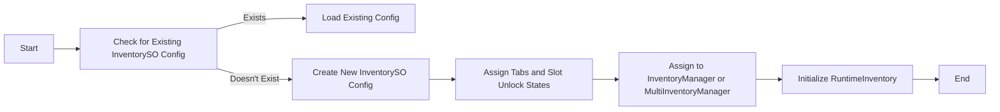
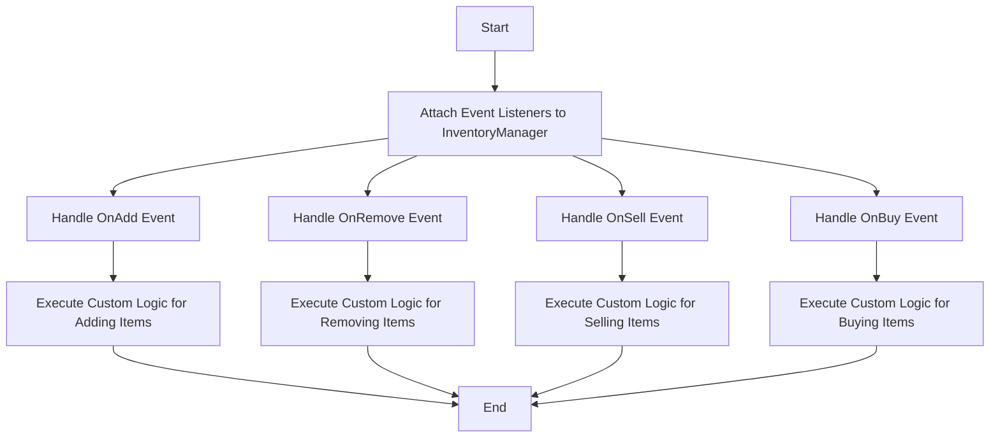
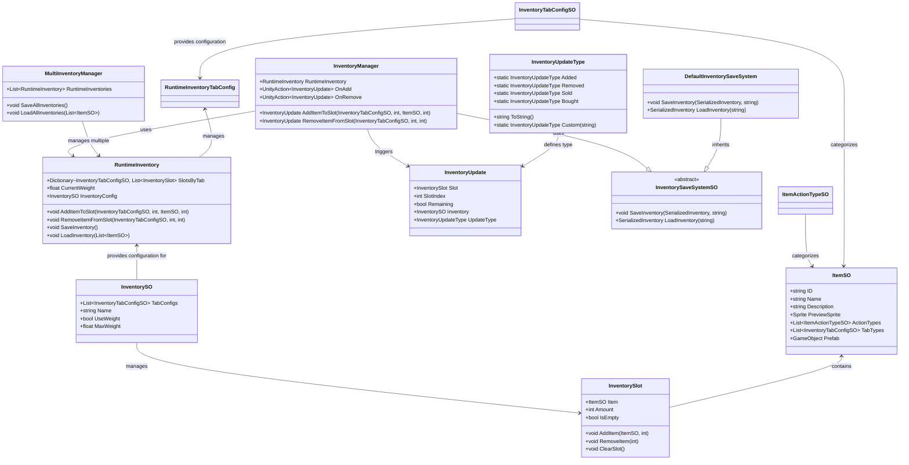

# Inventory System

A modular and flexible Unity Inventory System that supports dynamic item management, slot-based functionality, customizable saving and loading mechanisms, and more. This system separates configuration data from runtime data, making it efficient and easy to extend.

## Installation

1. In Unity, open the **Package Manager**.
2. Click the `+` icon in the top-left corner.
3. Select `Add package from git URL...`.
4. In the text box that appears, enter the project's Git URL: `https://github.com/FelixBole/inventory-system.git`
5. Click `Add` to install the package into your project.

## Creating New Items

To create new items for the inventory system:

1. **Create an Item ScriptableObject**:

   - Right-click in your Project window.
   - Select `Create > Slax > Inventory > Item`.
   - This will create a new `ItemSO` ScriptableObject.

2. **Configure Item Properties**:
   - **ID**: Provide a unique identifier for the item.
   - **Name**: Set the display name of the item.
   - **Description**: Optionally add a description for the item.
   - **Preview Sprite**: Assign a sprite to visually represent the item in the UI.
   - **Action Types**: Assign one or more `ItemActionTypeSO` objects to define what actions can be performed with the item (e.g., "Equip", "Consume").
   - **Tab Types**: Assign one or more `InventoryTabConfigSO` objects to categorize the item within the inventory (e.g., "Consumables", "Equipment").
   - **Prefab**: Optionally link a prefab that can be instantiated in the game world.
   - **Loot Settings**: Configure the minimum and maximum drops for this item when looted.

## Managing Item Slots

The inventory system uses a slot-based approach where each slot can hold a certain amount of a particular item. Slots are managed at runtime using `RuntimeInventory`.

1. **RuntimeInventory**:
   - Manages slots and items during gameplay.
   - Initialized using an `InventorySO` configuration.
2. **Adding Items to a Slot**:

   - Use the `AddItemToSlot` method in `RuntimeInventory` to add an item to a specific slot:

   ```csharp
   runtimeInventory.AddItemToSlot(tabType, slotIndex, itemSO, amount);
   ```

3. **Removing Items from a Slot**:

   - Use the `RemoveItemFromSlot` method in `RuntimeInventory` to remove a certain amount of an item from a specific slot:

   ```csharp
   runtimeInventory.RemoveItemFromSlot(tabType, slotIndex, amount);
   ```

4. **Finding Slots**:
   - **Find First Slot with Specific Item**:
     ```csharp
     var slot = runtimeInventory.FindSlot(tabType, itemSO);
     ```

## Communicating with the Inventory via Script

To interact with an inventory via script, use the `InventoryManager` component. Here’s a basic guide:

1. **Reference the Inventory**:

   ```csharp
   public class MyInventoryHandler : MonoBehaviour
   {
       [SerializeField] private InventoryManager inventoryManager;

       void Start()
       {
           var item = ... // Your ItemSO reference
           inventoryManager.AddItemToSlot(tabType, 0, item, 1);
       }
   }
   ```

2. **Listening to Inventory Events**:

   - The `InventoryManager` class fires events when items are added, removed, bought, or sold:

   ```csharp
   inventoryManager.OnAdd += HandleItemAdded;
   inventoryManager.OnRemove += HandleItemRemoved;

   void HandleItemAdded(InventoryUpdate update)
   {
       Debug.Log("Item added: " + update.Slot.Item.Name);
   }

   void HandleItemRemoved(InventoryUpdate update)
   {
       Debug.Log("Item removed: " + update.Slot.Item.Name);
   }
   ```

## Saving and Loading

The inventory system supports saving and loading inventory data. You can use the default JSON save system or implement a custom one.

### Using the Default Save System

To use the default save system, either import the samples, and one will be created for you or simply create one by going to `Create > Slax > Inventory > Default Inventory Save System` which will generate a ScriptableObject that you will be able to drag and drop into your InventoryManager for it to use it.

> Keep in mind a Save System needs to be set on the InventoryManager for saving and loading to work, there is no default configuration that is set up if you don't put anything. If in doubt, you can import the samples and use the InventoryManager prefab that is setup with the provided Default Save System.

1. **Save Inventory**:

   ```csharp
   inventoryManager.SaveInventory(); // Saves to JSON in the Application's persistent data path
   ```

2. **Load Inventory**:
   ```csharp
   inventoryManager.LoadInventory(allItems); // Loads from JSON
   ```

### Implementing a Custom Save System

To integrate a custom save system, create a class that inherits fromt the InventorySaveSystemSO abstract class and add the [CreateAssetMenu] attribute so you can create your save system.

1. **Create a Custom Save System**:

   ```csharp
    [CreateAssetMenu(menuName = "CustomSaveSystem")]
    public class CustomInventorySaveSystem : InventorySaveSystemSO
    {
        public override void SaveInventory(SerializedInventory inventoryData, string inventoryName)
        {
            Debug.Log("Saving inventory with custom inventory save system: " + inventoryName);
        }

        public override SerializedInventory LoadInventory(string inventoryName)
        {
            Debug.Log("Loading inventory with custom inventory save system: " + inventoryName);
            return null;
        }
    }
   ```

2. **Use the Custom Save System**: Create the asset from the script you've just created and drag it into the inventory manager that should use it.

### Managing Multiple Inventories

`MultiInventoryManager` allows you to manage multiple `RuntimeInventory` instances (e.g., for different characters or merchants):

> I would personally recommend using multiple individual InventoryManager classes but the choice is yours, you can extend them anyways.

1. **Save All Inventories**:

   ```csharp
   multiInventoryManager.SaveAllInventories();
   ```

2. **Load All Inventories**:
   ```csharp
   multiInventoryManager.LoadAllInventories(allItems);
   ```

## Some diagrams for visual representation

### How To Save and Load


### Creating a new config if none exists



### Reacting to events



### Inventory System Initialization Flow


## Class Communication Overview

Below is a diagram to illustrate how the different classes in the inventory system communicate with each other:



## Extensions

The Inventory System is designed to be modular and extendable. You can enable or disable certain features based on your game’s needs. Below are the available extensions:

### Weight System

The weight system allows you to enforce a weight limit on your inventory. Items can be assigned a weight, and the inventory will track the total weight of items added. If adding an item would exceed the weight limit, the system will prevent the item from being added and trigger an event that you can respond to.

**How to Enable:**

1. **Set up item weights:**

   - In the `ItemSO` ScriptableObject, assign a weight value to each item. The default weight is `0` if not set.

2. **Enable the weight system in the inventory:**

   - In the `InventorySO` ScriptableObject, toggle the `UseWeight` option.
   - Set the `MaxWeight` value to define the maximum allowable weight for the inventory.

3. **Subscribe to the weight limit event:**
   - Use the `OnWeightLimitReached` event in `RuntimeInventory` to handle cases where the weight limit is reached.

**Example:**

```csharp
void Start()
{
    var runtimeInventory = new RuntimeInventory(inventoryConfig);

    runtimeInventory.OnWeightLimitReached += HandleWeightLimitReached;

    var item = ... // Your ItemSO reference
    runtimeInventory.AddItemToSlot(tabType, 0, item, 5);
}

void HandleWeightLimitReached(float currentWeight, float maxWeight)
{
    Debug.Log($"Cannot add item: Weight limit reached! Current: {currentWeight}, Max: {maxWeight}");
}
```

### Size Limit System

The size limit system allows you to enforce a slot limit in your inventory. Slots can be progressively unlocked during gameplay based on predefined unlock states.

**How to Enable:**

1. **Configure Slot Unlock States:**

   - Create `SlotUnlockStateSO` assets to define the initial and additional slots that can be unlocked.
   - The first `SlotUnlockStateSO` in the list determines the initial number of unlocked slots.

2. **Set Up Inventory:**

   - Add `SlotUnlockStateSO` assets to the `_slotUnlockStates` list in the `InventoryTabConfigSO`.

3. **Unlocking Slots During Gameplay:**
   - Use the `UnlockSlotsForTab` method in `RuntimeInventory` to unlock additional slots during gameplay.

**Example:**

```csharp
void Start()
{
    var runtimeInventory = new RuntimeInventory(inventoryConfig);

    var initialUnlockState = ... // Reference to your initial SlotUnlockStateSO
    runtimeInventory.UnlockSlotsForTab(tabType, initialUnlockState);

    var item = ... // Your ItemSO reference
    runtimeInventory.AddItemToSlot(tabType, 5, item, 1);
}
```
